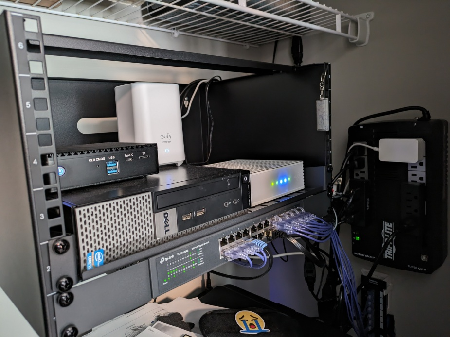

+++
title = 'My Home Network'
date = 2024-05-05
draft = false
tags = ['infrastructure']
+++

Here's an overview of my home network setup.

## Office Closet

This is where I keep most of my network equipment in a small rack mounted on the wall.

### Router

* Hardware: [N5105 Mini PC](https://www.aliexpress.us/item/3256804761963374.html)
* Software: [OPNSense](https://opnsense.org/)
* Interfaces:
  * LAN - everything wired + main wifi ssid
  * Guest - for guest wifi ssid
  * IoT - for iot wifi ssid

Works really well.
Interfaces are set up so that Guest and IoT can't access things outside them.

Previously used my OptiPlex 7010 for this.

### Home Server

* Hardware: OptiPlex 7010
* Software: [Proxmox](https://www.proxmox.com)

This is what I use to self-host a few projects. Works pretty well, but could use an upgrade.

### NAS

* Hardware:
  * Motherboard: [N5105](https://www.aliexpress.us/item/3256805052866375.html)
  * Case: [JONSBO N1](https://www.amazon.com/gp/product/B09WZLHCZG)
  * Memory: 32 GB
  * Storage: 4x 6 TB Seagate Constellation ES.3
* Software: [TrueNAS SCALE](https://www.truenas.com/truenas-scale/)

This is what I use for storage. Works great.

Previously used my rpi4b for this, which wasn't great.

### Other

* Hitron CODA modem
* 24 port TP-Link network switch
* 12 port TRENDnet patch panel
  * cat6 cables from other rooms run to this
* Eufy HomeBase 2
  * used for smart doorbell + door sensor
* Tripp Lite UPS
* Brother MFCL2710DW printer
* StarTech 6U rack
* Monoprice SlimRun Cat6A cables

## Living Room

This is where I keep my access point, since it wouldn't work great from the closet.

### Access Point

* Hardware: [TP-Link AC1200](https://www.amazon.com/gp/product/B08SBXVSF3/) v2
* Software: [OpenWrt](https://openwrt.org/)
* SSIDs:
  * $WIFI
  * $WIFI - Guest
  * $WIFI - IoT

It uses the router interfaces to keep the different networks isolated.

Resources:

* [https://frdmtoplay.com/configuring-a-vlan-per-ssid-with-openwrt-and-pfsense/](https://frdmtoplay.com/configuring-a-vlan-per-ssid-with-openwrt-and-pfsense/)

### Other

* 8 port TP-Link network switch
* Fire TV Stick 4K Max
  * this is for Kodi

## Office

This is where I work from.

### Desktop

* Hardware:
  * CPU: AMD Ryzen 5 5600X
  * GPU: AMD Radeon RX 7900 XT
  * Memory: 32 GB
* Software: Arch Linux

My primary computer. Currently using Arch, but might revisit Pop OS when COSMIC is ready.

### Other

* Tripp Lite UPS

## Kitchen

This is where I cook.

### Prusa MK4

My 3d printer, connected to wifi.

## IoT

Various devices connected to the IoT network.

* myQ garage door opener
* Kasa light bulbs
  * not great, they seem to die quick
* Kasa smart outlets
* Eufy doorbell
  * didn't want to pay for Ring subscription
* Eufy door sensor
* Withings Sleep
  * works great
* Withings smart scale

Thinking of trying Zigbee or Z-wave in the future.

Let me know if there's anything I should expand on.
